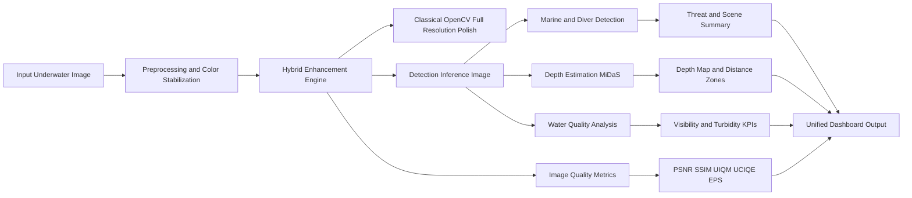
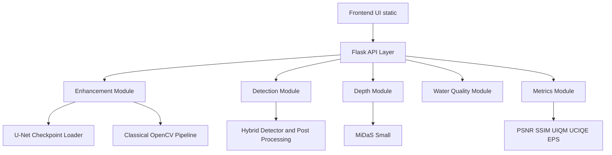

# JalDrishti: Underwater Enhancement and Maritime Scene Intelligence

JalDrishti is an end-to-end computer vision system for underwater environments.  
It enhances low-visibility images, estimates depth, detects divers and marine objects, and reports quality metrics in one integrated workflow.

It is built to be technically strong and presentation-ready for academic evaluation.

---

## Project Motivation

Underwater imaging is difficult because of:
- low contrast and haze
- dominant green/blue color cast
- backscatter and suspended particles
- poor edge visibility

JalDrishti addresses these problems using a hybrid pipeline that combines deep learning, classical enhancement, depth estimation, and scene-aware detection.

---

## Key Features

- **Hybrid image enhancement** (U-Net + classical OpenCV)
- **Object detection** for divers and marine classes
- **Depth map generation** with MiDaS and fallback resilience
- **Water-quality analytics** (visibility and turbidity indicators)
- **Quality metrics panel** (PSNR, SSIM, UIQM, UCIQE, EPS)
- **Interactive web UI** for upload, comparison, and analysis

---

## End-to-End Workflow



---

## Architecture



---

## Technology Stack

- Python
- Flask
- PyTorch, torchvision, timm
- Ultralytics YOLO and YOLO-World
- OpenCV, Pillow, NumPy, SciPy, scikit-image
- HTML, CSS, JavaScript
- Git LFS for large model artifacts

---

## Datasets

- **UIEB** (paired underwater enhancement data)
- **DeepFish**
- **Fish4Knowledge**
- **TrashCan**

These datasets support enhancement quality and underwater scene understanding.

---

## Repository Structure

| Path | Purpose |
|---|---|
| `api.py` | Main Flask API with route orchestration |
| `enhance.py` | Hybrid enhancement pipeline |
| `detection/` | Marine/diver detectors and post-processing |
| `depth/` | MiDaS depth estimation module |
| `analysis/` | Quality metrics, water analytics, threat scoring |
| `model_loader.py` | Checkpoint loading utilities |
| `config.py` | Central configuration |
| `static/` | Frontend UI |
| `outputs/checkpoints/` | Enhancement checkpoints |
| `data/JalDrishti/` | Local model/data artifacts |
| `wiki-draft/` | Project report pages |

---

## Quick Start

### 1) Clone and pull model artifacts

```bash
git clone https://github.com/MeetJain0170/Jal-prac.git
cd Jal-prac
git lfs install
git lfs pull
```

### 2) Install dependencies

```bash
python3 -m venv .venv
source .venv/bin/activate
pip install -r requirements.txt
```

### 3) Run locally

```bash
python api.py
```

Open: `http://localhost:5500`

---

## Main API Endpoints

- `GET /api/status`
- `POST /api/enhance`
- `POST /api/detect`
- `POST /api/depth`
- `POST /api/analyze-water`
- `GET /api/gallery`
- `POST /api/gallery/save`
- `DELETE /api/gallery/clear`

---

## Validation Checklist

- LFS files are present and loaded
- `/api/status` reports model and module readiness
- enhancement outputs render correctly
- detection overlays are scene-consistent
- depth map and analytics are generated
- metrics are finite and updated in UI

---

## Challenges and Improvements

Current challenges:
- confidence tuning under diverse underwater scenes
- green/blue cast control during enhancement
- shark vs diver ambiguity in cluttered frames
- metric stability under strong transformations

Future improvements:
- larger class-balanced underwater data
- class-specific fine-tuning (especially shark/diver)
- video-level temporal consistency
- optimized inference deployment pipeline

---

## Conclusion

JalDrishti delivers a complete underwater vision pipeline from raw image input to enhanced output, object intelligence, and quantitative analytics.  
The project combines practical engineering, explainable design, and strong presentation quality for final-year project review.
